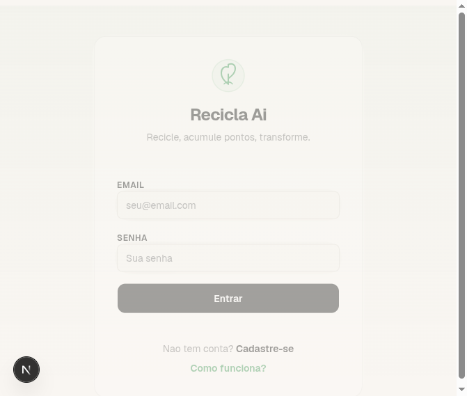
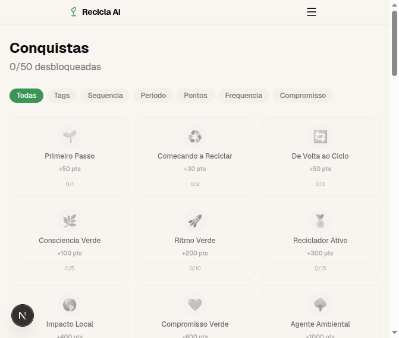
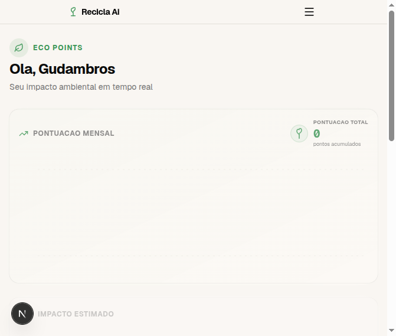
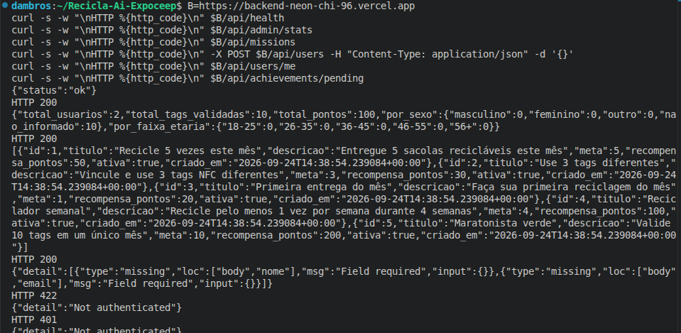

# RELATÓRIO TÉCNICO – ETAPA 2: PERSISTÊNCIA DE DADOS E CRUD NA API

Projeto Integrador EXPOCEEP 2026 – Recicla Aí: Sistema de Reciclagem Urbana e Coleta Seletiva

- Componente Curricular: Programação Back-End
- Turma: 3C – Técnico em Desenvolvimento de Sistemas
- Nome do Projeto / Tema: Recicla Aí – reciclagem urbana com TAGs NFC, pontos, missões e conquistas
- Integrantes do Grupo: Gustavo Dambros Dias de Souza e Ana Heloise Alves
- Link do Repositório GitHub: https://github.com/gustavodiassouza19-3C/Recicla-Ai-Expoceep
- Stack do grupo: FastAPI (Python) no back-end, Supabase (PostgreSQL) como banco na nuvem, Next.js no front-end, deploy na Vercel

## 1. OBJETIVO DA ETAPA 2

Ligar a aplicação Python ao banco de dados relacional, implementar as rotas do CRUD (CREATE, READ, UPDATE) e as ações da regra de negócio do projeto (validação de TAGs, missões, resgate de conquistas), testando cada resposta HTTP com requisições de verdade e guardando as evidências.

As tabelas que usamos no Supabase/PostgreSQL: usuarios, tags, reciclagens, recompensas, missoes, conquistas, eco_pontos e usuario_conquistas (essa última com a coluna resgatada_em controlando o resgate).

## 2. MAPEAMENTO DAS ROTAS DA API RESTful

As rotas ficam em backend/app/routes/, com os prefixos registrados em backend/app/main.py. Todas seguem o padrão REST e validam entrada e saída com Pydantic:

| Operação | Método HTTP | Rota (URL) | Descrição da Funcionalidade | Status HTTP |
| :---- | :---- | :---- | :---- | :---- |
| Create | POST | /api/users | Cadastra um novo usuário (valida nome e email) | 201 Created |
| Create | POST | /api/tags | Cadastra uma nova TAG NFC | 201 Created |
| Create | POST | /api/recycle | Registra e valida uma reciclagem | 201 Created |
| Create | POST | /api/eco-points | Cadastra um ponto de coleta | 201 Created |
| Read | GET | /api/users/me | Retorna o usuário autenticado | 200 OK |
| Read | GET | /api/tags/me | Lista as TAGs do usuário | 200 OK |
| Read | GET | /api/recycle/history | Histórico de reciclagens | 200 OK |
| Read | GET | /api/missions | Lista missões disponíveis | 200 OK |
| Read | GET | /api/achievements/progress | Progresso das conquistas | 200 OK |
| Read | GET | /api/achievements/pending | Conquistas pendentes de resgate | 200 OK |
| Update | PUT | /api/users/me | Atualiza dados do usuário | 200 OK |
| Ação | POST | /api/missions/{id}/complete | Conclui uma missão | 200 OK |
| Ação | POST | /api/achievements/{codigo}/claim | Resgata uma conquista (credita pontos) | 200 OK |
| Ação | POST | /api/achievements/claim-all | Resgata todas as pendentes | 200 OK |
| Ação (admin) | POST | /api/admin/validate-tag | Admin valida e libera TAG NFC do usuário | 200 OK |

Sobre validação e segurança: se faltar campo obrigatório, volta 422; rota protegida sem token volta 401; ID que não existe volta 404. As consultas são montadas pelo construtor do supabase-py, sem concatenar strings, então não há brecha de SQL Injection.

O DELETE a gente não expôs publicamente de propósito. Exclusão passa pelo painel admin, com RLS (Row Level Security) no Supabase.

## 3. COMPROVAÇÃO PRÁTICA E EVIDÊNCIAS DE FUNCIONAMENTO

### Evidência 1: Cadastro com validação (CREATE – POST /api/users)

Mandamos um POST /api/users de corpo vazio e o back-end barrou com 422, listando exatamente o que faltou:

```json
POST https://backend-neon-chi-96.vercel.app/api/users  →  HTTP 422
{
  "detail": [
    { "type": "missing", "loc": ["body", "nome"], "msg": "Field required", "input": {} },
    { "type": "missing", "loc": ["body", "email"], "msg": "Field required", "input": {} }
  ]
}
```

Quando o corpo vem certo, a rota salva no Supabase e devolve 201 Created. É por essa tela que o cadastro chega na API:



### Evidência 2: Leitura protegida (READ – GET)

Chamamos GET /api/users/me sem token e a resposta foi 401. Ou seja, a rota existe e está pedindo login como deveria:

```json
GET https://backend-neon-chi-96.vercel.app/api/users/me  →  HTTP 401
{ "detail": "Not authenticated" }
```

Logado, as rotas GET (/api/tags/me, /api/recycle/history, /api/achievements/progress, /api/missions) devolvem os registros em JSON com 200 OK. As telas do sistema consomem direto dessas rotas:



### Evidência 3: Atualização e fluxo autenticado (UPDATE – PUT /api/users/me)

O PUT /api/users/me atualiza os dados de quem está logado (nome, tamanho da família e por aí vai) e responde 200 OK com o registro já atualizado. No front, a mudança aparece depois do refreshUser(). A entrada desse fluxo:



### Evidência 4: Regra de negócio persistida (resgate de conquistas)

Conquista desbloqueada não vira ponto na hora: ela fica pendente (GET /api/achievements/pending) e só entra na conta depois do resgate (POST /api/achievements/{codigo}/claim ou /claim-all), que preenche resgatada_em em usuario_conquistas. Tudo gravado no PostgreSQL. Tela inicial do sistema no ar:


### Evidência 5: Terminal com as rotas funcionando

Rodamos esta sequência no terminal contra a base de produção (B=https://backend-neon-chi-96.vercel.app): health, estatísticas, missões, cadastro com corpo vazio, leitura sem token e pendentes sem token.

Comandos executados:

    B=https://backend-neon-chi-96.vercel.app
    curl -s -w "\nHTTP %{http_code}\n" $B/api/health
    curl -s -w "\nHTTP %{http_code}\n" $B/api/admin/stats
    curl -s -w "\nHTTP %{http_code}\n" $B/api/missions
    curl -s -w "\nHTTP %{http_code}\n" -X POST $B/api/users -H "Content-Type: application/json" -d '{}'
    curl -s -w "\nHTTP %{http_code}\n" $B/api/users/me
    curl -s -w "\nHTTP %{http_code}\n" $B/api/achievements/pending

Resultado esperado: 200, 200, 200, 422, 401, 401.



## 4. DIFICULDADES ENCONTRADAS E SOLUÇÕES ADOTADAS

1. O deploy do front-end quebrava no Vercel com "Couldn't find any pages or app directory". Fomos ver e o Root Directory dos projetos estava na raiz do repo, mas o Next.js mora em recicla-ai-expoceep-app/. Ajustamos o Root Directory nos projetos e fizemos redeploy.
2. Depois o build passou a falhar com "supabaseKey is required". O motivo: criamos as variáveis NEXT_PUBLIC_* no Vercel depois do push, e o client do Supabase é montado em tempo de build. Cadastramos NEXT_PUBLIC_SUPABASE_URL, NEXT_PUBLIC_SUPABASE_ANON_KEY e NEXT_PUBLIC_API_URL (produção, preview e desenvolvimento) e rodamos o deploy de novo.
3. Os endereços do back-end ficaram dando 404 depois de um push. Descobrimos que os deploys via GitHub estavam buildando vazio, pelo mesmo problema de Root Directory, agora na pasta backend/. Corrigimos igual ao item 1 e conferimos as rotas (401 ali significa que a rota existe e pede autenticação).
4. As rotas GET /api/eco-points e GET /api/missions devolviam 500 por dois motivos diferentes. Na primeira, o modelo Pydantic usava name/address enquanto a tabela eco_pontos usa nome/endereco, e a validação da resposta derrubava tudo (corrigido em backend/app/models/eco_point.py). Na segunda, as tabelas missoes e missoes_usuario nem existiam no banco de produção, então recriamos pelo dashboard com a migration 007_create_missoes_prod.sql.
5. Falta aplicar a migration do resgate (resgatada_em) no Supabase via SQL Editor. Deixamos registrado como próximo passo para não segurar a entrega.

## 5. CONSIDERAÇÕES FINAIS E PRÓXIMOS PASSOS

Fechamos a Etapa 2 com a API salvando e lendo dados de verdade no Supabase: campos validados, rotas de leitura e escrita pedindo autenticação e erros tratados (401, 404, 422). O repositório está na branch main do GitHub, e o .gitignore segura .env*, node_modules/, .next/ e o resto dos artefatos locais.

Para a Etapa 3: aplicar a migration 006_usuario_conquistas_resgate.sql no Supabase; testar o resgate inteiro na ordem certa (desbloquear, notificar, "Pegar prêmio", creditar pontos); e avançar nas telas que usam as rotas já validadas (missões, recompensas e eco-pontos).
